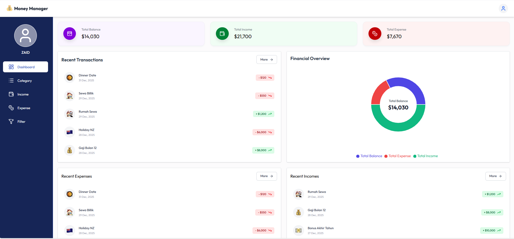
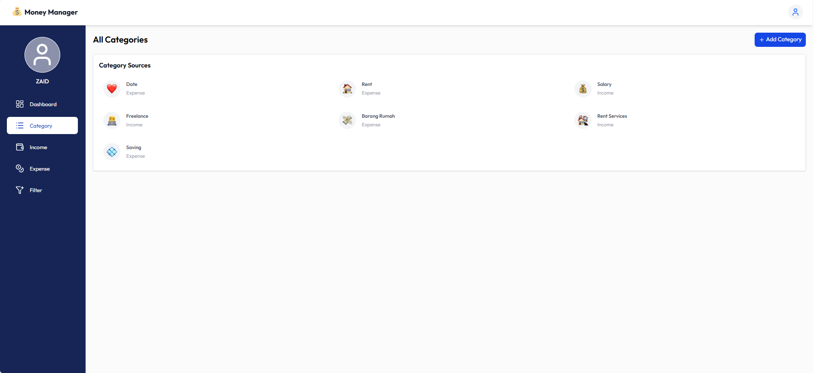
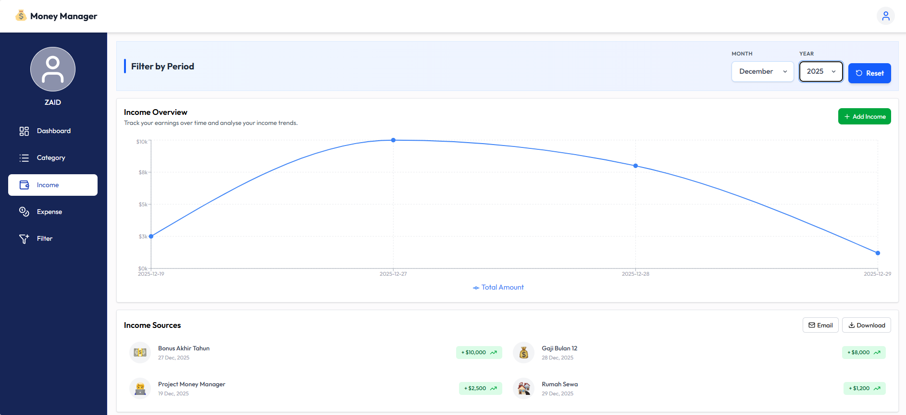
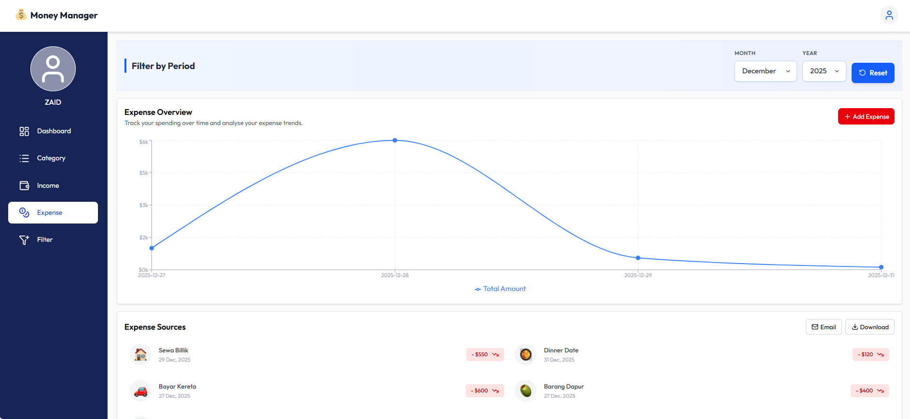
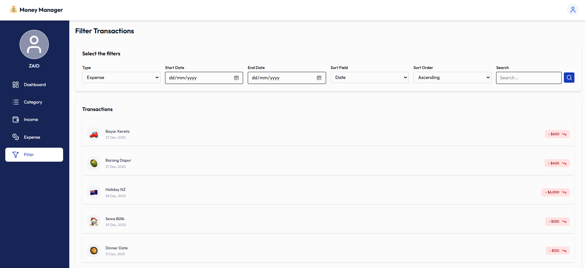
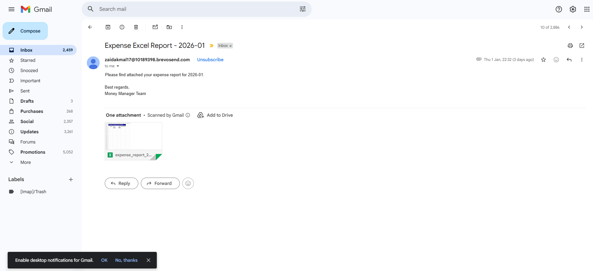

# Money Manager Web App

A modern web application for managing personal finances, tracking income and expenses with visual analytics.

## � Live Demo & Repository

- **Frontend**: https://fza-moneymanager.netlify.app/
- **Backend Repository**: https://github.com/fikriupm/Money-Manager-api

> **Note**: The backend API is deployed on Render's free tier and may experience inactivity suspensions. Please allow a moment for the service to spin up on first use (or suspended already).

## �📸 UI 

<div align="center">
  <table>
    <tr>
      <td align="center">
        
        <p><em>Dashboard</em></p>
      </td>
      <td align="center">
        
        <p><em>Category</em></p>
      </td>
    </tr>
    <tr>
      <td align="center">
        
        <p><em>Income Tracking</em></p>
      </td>
      <td align="center">
        
        <p><em>Expense Management</em></p>
      </td>
    </tr>
    <tr>
      <td align="center" colspan="2">
        
        <p><em>Filter</em></p>
      </td>
      <td align="center">
        
        <p><em>Email Report</em></p>
      </td>
    </tr>
  </table>
</div>

## Features

- 📊 **Dashboard Overview** - View your financial summary at a glance with pie charts and line graphs
- 💰 **Income Tracking** - Add, view, and manage income transactions
- 💸 **Expense Tracking** - Track and categorize expenses
- 🏷️ **Categories** - Create custom categories with emoji icons
- 📅 **Period Filtering** - Filter transactions by month and year
- 📈 **Visual Analytics** - Interactive charts using Recharts
- 📥 **Export Data** - Download financial reports as Excel files
- 📧 **Email Reports** - Send reports directly to your email
- 👤 **User Profiles** - Personalized profiles with custom avatars

## Tech Stack

- **Frontend**: React 19.2.0 with React Router DOM
- **Styling**: Tailwind CSS 4.1.17
- **Charts**: Recharts 3.5.0
- **HTTP Client**: Axios 1.13.2
- **Build Tool**: Vite 5.x
- **Icons**: Lucide React
- **Date Handling**: Moment.js
- **Notifications**: React Hot Toast

## Prerequisites

- Node.js (v16 or higher)
- npm or yarn
- Backend API running on `http://localhost:8080/api/v1.0`

## Installation

1. Clone the repository:
```bash
git clone <repository-url>
cd moneymanagerwebapp
```

2. Install dependencies:
```bash
npm install
```

3. Configure API endpoint:
   - Update `src/util/apiEndpoints.js` with your backend URL if needed

4. Start the development server:
```bash
npm run dev
```

5. Open your browser and navigate to `http://localhost:5173`

## Available Scripts

- `npm run dev` - Start development server
- `npm run build` - Build for production
- `npm run preview` - Preview production build
- `npm run lint` - Run ESLint

## Project Structure

```
src/
├── assets/          # Static assets
├── components/      # Reusable UI components
├── context/         # React Context for global state
├── hooks/           # Custom React hooks
├── pages/           # Page components
└── util/            # Utility functions and configurations
```

## Key Components

- **Dashboard** - Main layout with sidebar navigation
- **PeriodFilter** - Month/year selector with reset functionality
- **CustomPieChart** - Donut chart for financial visualization
- **CustomLineChart** - Line chart for transaction trends
- **InfoCard** - Metric display cards
- **Modal** - Reusable modal component
- **EmojiPickerPopup** - Custom emoji selector

## API Endpoints

The app connects to a backend API with endpoints for:
- User authentication (login/register)
- Income management
- Expense management
- Category management
- Excel export
- Email reports

## Contributing

Feel free to submit issues and enhancement requests.

## License

This project is private and not licensed for public use.

## Contact

Email: fikrizaidakmal@gmail.com

