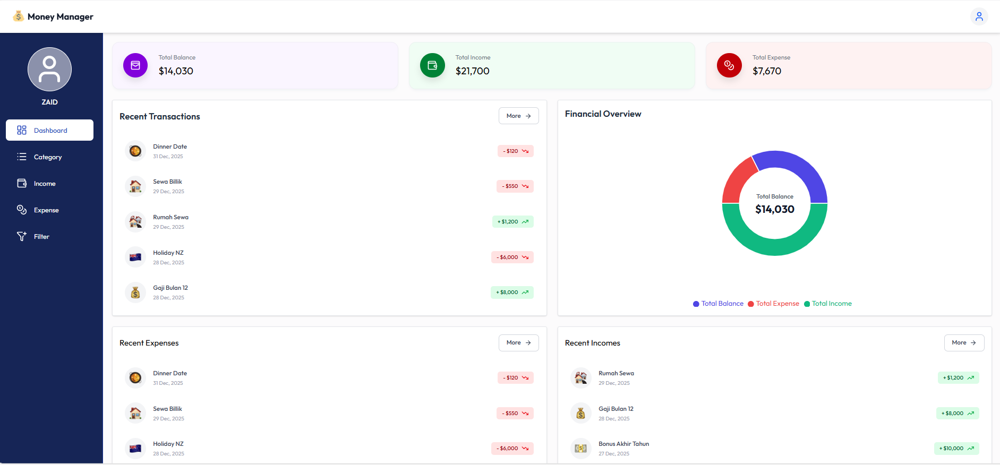
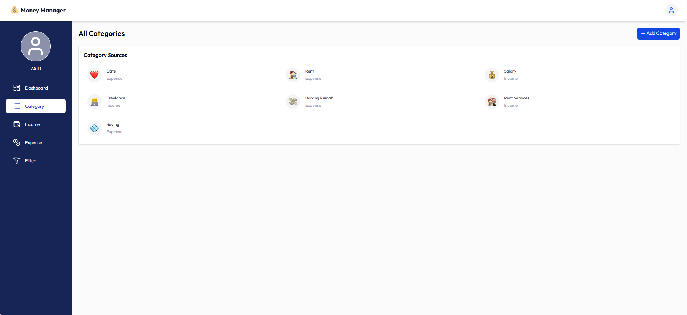
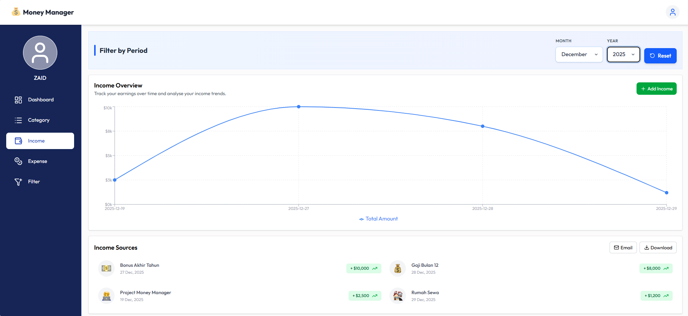
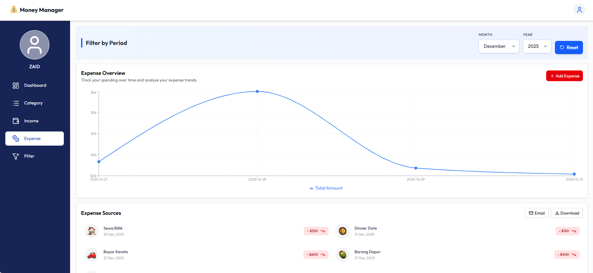
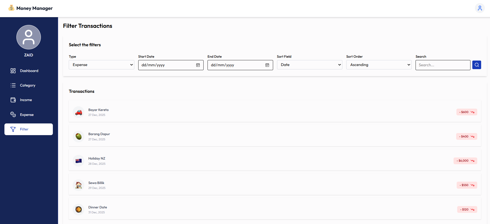
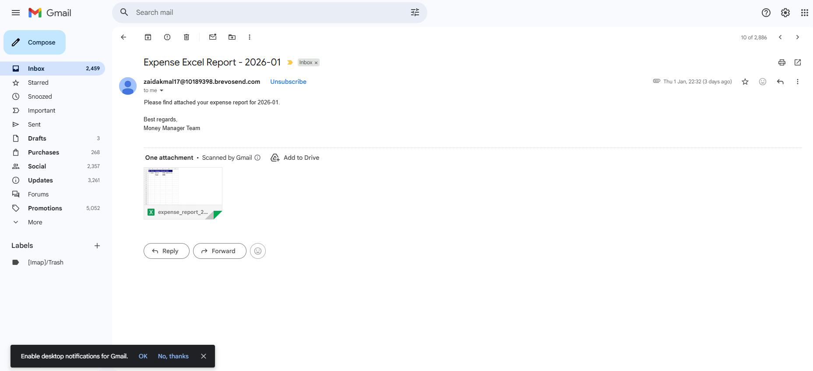

# Money Manager Web App

A modern web application for managing personal finances, tracking income and expenses with visual analytics.

## Live Demo & Repository

- **Frontend**: https://fza-moneymanager.netlify.app/
- **Backend Repository**: https://github.com/fikriupm/Money-Manager-api

> **Note**: The backend API is deployed on Render's free tier, which spins down after inactivity. On first use, please allow **up to a minute** for the service to wake up (login/register will feel stuck — just wait and retry once).
>
> **If the backend never responds** (Render free-tier services can get suspended), the live demo won't be able to log in. In that case, please run the app locally instead — clone both repositories and follow the [Installation](#installation) steps below (the local frontend automatically proxies API calls to a backend running on `http://localhost:8080`).

### Checking whether the Render backend is up

1. Open the public health URL: https://money-manager-api-xrpm.onrender.com/api/v1.0/status
2. **Be patient on the first request** — a free-tier service that has gone to sleep takes up to a minute to cold-start. The tab will look stuck; that's normal.
3. **If it responds** (any response, even a plain "OK"), the backend is awake and the live demo will work.
4. **If it still times out after ~2 minutes**, the service is down or suspended — use the local setup below instead. (Owner: check the service state and logs at https://dashboard.render.com.)

## UI 

<div align="center">
  <table>
    <tr>
      <td align="center">
        
        <p><em>Dashboard</em></p>
      </td>
      <td align="center">
        
        <p><em>Category</em></p>
      </td>
    </tr>
    <tr>
      <td align="center">
        
        <p><em>Income Tracking</em></p>
      </td>
      <td align="center">
        
        <p><em>Expense Management</em></p>
      </td>
    </tr>
    <tr>
      <td align="center">
        
        <p><em>Filter</em></p>
      </td>
      <td align="center">
        
        <p><em>Email Report</em></p>
      </td>
    </tr>
  </table>
</div>

## Features

- 📊 **Dashboard Overview** - View your financial summary at a glance with pie charts and line graphs
- 💰 **Income Tracking** - Add, view, and manage income transactions
- 💸 **Expense Tracking** - Track and categorize expenses
- 🏷️ **Categories** - Create custom categories with emoji icons
- 📅 **Period Filtering** - Filter transactions by month and year
- 📈 **Visual Analytics** - Interactive charts using Recharts
- 📥 **Export Data** - Download financial reports as Excel files
- 📧 **Email Reports** - Send reports directly to your email
- 👤 **User Profiles** - Personalized profiles with custom avatars
- 🤖 **AI Category Suggestion** - One click suggests the best category for an expense (Gemini-powered)
- 💬 **AI Finance Assistant** - "Ringgit" chat widget answers questions about your own transactions, with Smart (full-context) and RAG (vector retrieval) modes

## Tech Stack

- **Frontend**: React 19.2.0 with React Router DOM
- **Styling**: Tailwind CSS 4.1.17
- **Charts**: Recharts 3.5.0
- **HTTP Client**: Axios 1.13.2
- **Build Tool**: Vite 5.x
- **Icons**: Lucide React
- **Date Handling**: Moment.js
- **Notifications**: React Hot Toast

## Prerequisites

- Node.js (v16 or higher)
- npm or yarn
- Backend API running on `http://localhost:8080/api/v1.0`

## Installation

1. Clone the repository:
```bash
git clone <repository-url>
cd moneymanagerwebapp
```

2. Install dependencies:
```bash
npm install
```

3. Configure API endpoint (optional):
   - By default the dev server proxies `/api` requests to `http://localhost:8080`, so no configuration is needed when the backend runs locally
   - To point at a different backend, set `VITE_BASE_URL` (e.g. in a `.env.local` file: `VITE_BASE_URL=https://your-backend/api/v1.0`)

4. Start the development server:
```bash
npm run dev
```

5. Open your browser and navigate to `http://localhost:5173`

## Available Scripts

- `npm run dev` - Start development server
- `npm run build` - Build for production
- `npm run preview` - Preview production build
- `npm run lint` - Run ESLint

## Run with Docker

The image is environment-agnostic: nginx serves the built SPA and reverse-proxies `/api` to whatever `BACKEND_URL` points at when the container starts — no API URL is baked into the build, and CORS never applies.

```bash
docker build -t moneymanager-frontend .
docker run -p 5173:80 -e BACKEND_URL=http://host.docker.internal:8080 moneymanager-frontend
```

To run the **full stack** (MySQL + Redis + backend + frontend) with one command, use the compose file in the [backend repository](https://github.com/fikriupm/Money-Manager-api) under `deploy/` — see its `deploy/README.md` for Docker Compose and Kubernetes instructions.

## Seed Demo Data

The AI features (category suggestion, finance chat) are much more interesting with history to reason over. The seeder generates ~6 months of realistic MYR transactions and pushes them through the real REST API:

```bash
node seed/seed.mjs --dump      # only write seed/dataset.json, no API calls
node seed/seed.mjs             # register/login the demo account and push everything
node seed/seed.mjs --email you@example.com --password secret --name "You"
```

Requires Node 18+ and the backend running on `http://localhost:8080` (override with `--url`). Re-running pushes the same data again — use a fresh account to avoid duplicates.

## Project Structure

```
src/
├── assets/          # Static assets
├── components/      # Reusable UI components
├── context/         # React Context for global state
├── hooks/           # Custom React hooks
├── pages/           # Page components
└── util/            # Utility functions and configurations
```

## Key Components

- **Dashboard** - Main layout with sidebar navigation
- **PeriodFilter** - Month/year selector with reset functionality
- **CustomPieChart** - Donut chart for financial visualization
- **CustomLineChart** - Line chart for transaction trends
- **InfoCard** - Metric display cards
- **Modal** - Reusable modal component
- **EmojiPickerPopup** - Custom emoji selector

## API Endpoints

The app connects to a backend API with endpoints for:
- User authentication (login/register)
- Income management
- Expense management
- Category management
- Excel export
- Email reports

## Contributing

Feel free to submit issues and enhancement requests.

## License

This project is private and not licensed for public use.

## Contact

Email: fikrizaidakmal@gmail.com

